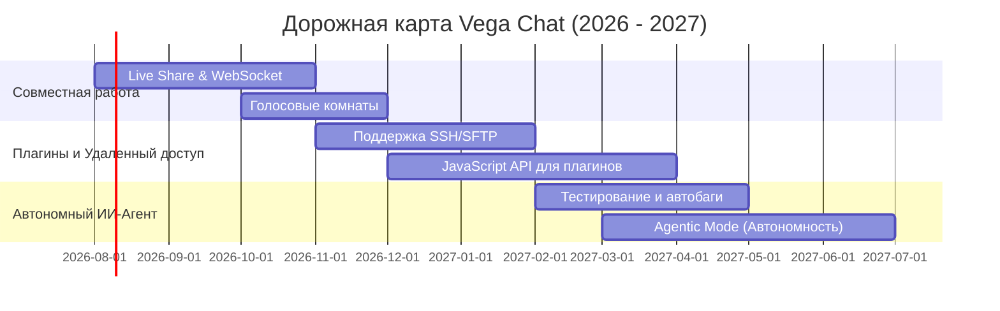

# 🚀 Vega Chat — Мобильная IDE с поддержкой ИИ

**Vega Chat** — это мощная мобильная среда разработки (IDE) со встроенным ИИ-помощником и полноценным визуальным Git-клиентом, созданная для того, чтобы вы могли профессионально писать, запускать и отправлять код прямо со своего телефона.

---

## ✨ Основные возможности (Features)

*   **⚡ Встроенный Code Runner:** Запуск скриптов Python, JavaScript, Bash и компиляция проектов прямо из редактора в интерактивной консоли с WebSocket-стримингом.
*   **🎭 Встроенный Inline AI Assistant:** Выделяйте блок кода, пишите промпт и просматривайте изменения в интерактивном Diff-сравнении (зеленый/красный цвет) с кнопками «Принять» или «Отклонить» изменения.
*   **🌿 Визуальный Git-клиент:** 
    *   Просмотр списка измененных файлов и интерактивное построчное сравнение `git diff`.
    *   Индексация отдельных файлов (Stage/Unstage) в один тап.
    *   Создание и переключение веток (Branch Selector) и синхронизация проекта через Pull/Push.
*   **🧠 Умное автодополнение:** Автозакрытие скобок и кавычек, предиктивная строка ввода с подсказками по коду и умные отступы на Enter.
*   **🎨 Премиум темы и шрифты:** Поддержка профессиональных шрифтов для разработчиков (JetBrains Mono, Fira Code, Source Code Pro, Roboto Mono) и популярных цветовых схем (Slate, OLED Black, Solarized, Monokai).
*   **🎤 Голосовой кодинг:** Голосовой ввод с автоматическим форматированием знаков препинания на русском языке.

---

## 🗺️ Дорожная карта развития (Future Roadmap)

Ниже представлена будущая карта развития Vega Chat:

### 📅 III Квартал 2026: Коллаборативная разработка (Vega Live Share)
*   **Совместное редактирование в реальном времени:** Подключение нескольких разработчиков к одному проекту по WebSockets с отображением курсоров пользователей.
*   **Интегрированная голосовая связь:** Возможность созваниваться прямо внутри сессии кодинга для быстрого обсуждения архитектуры.

### 📅 IV Квартал 2026: Расширение экосистемы и серверов
*   **Поддержка SSH / SFTP:** Подключение удаленных серверов в качестве рабочего пространства с возможностью редактирования и исполнения кода на удаленной машине.
*   **API для плагинов (JS/Dart):** Возможность расширения функционала IDE пользователями: создание кастомных подсветок, сниппетов и интеграций.

### 📅 I-II Квартал 2027: Автономный ИИ-Агент (Agentic Mode)
*   **Тестирование и авто-багфикс:** Автоматическое написание юнит-тестов и поиск уязвимостей/ошибок в кодовой базе с автоматическим предложением готовых исправлений.
*   **Режим Автономного Агента:** Вы даете цель текстом («Добавь авторизацию через Google в проект»), а ИИ-агент сам планирует шаги, создает файлы, пишет логику и проверяет работоспособность.
